#  Serverless Image File Validation and Notification System 

This project implements a **serverless, event-driven architecture** on AWS to automatically validate image uploads. Only **JPG and PNG** image files are allowed. Any other file type is **detected and deleted automatically**, with logs captured for monitoring and debugging.  The system also sends **real-time notifications using Amazon SNS** to inform users about successful uploads or invalid file deletions.
The solution is **fully serverless, scalable, secure, and cost-efficient**, requiring **zero server management**.

---

##  Architecture Diagram

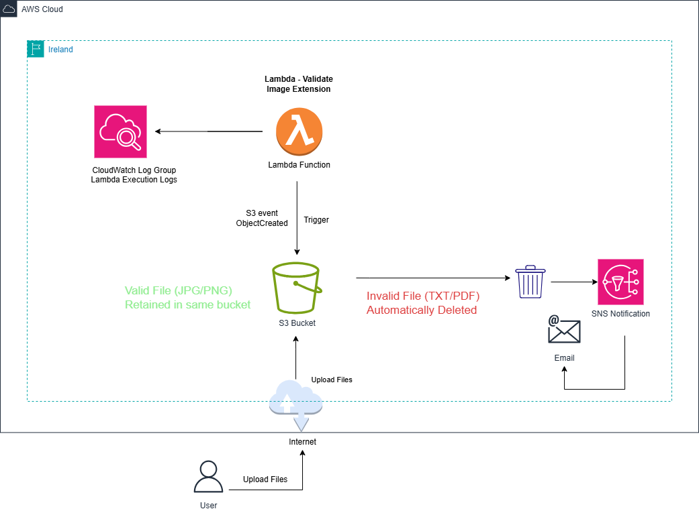

---

##  AWS Services Used
- **Amazon S3** – Object storage and event trigger
- **AWS Lambda** – File validation and deletion logic
- **Amazon SNS** – Real-time notifications
- **Amazon CloudWatch** – Logging and monitoring
- **AWS IAM** – Secure access control

---

##  Implementation Steps

### Step 1: Create an S3 Bucket
- Create an S3 bucket with a unique name
- Keep public access blocked
- This bucket is used for file uploads

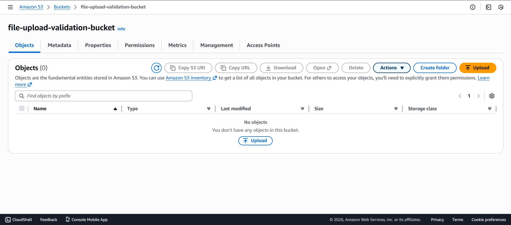

---

### Step 2: Create SNS Topic (For Notification)
- Go to SNS → Create topic  
- Type: Standard  
- Topic name: FileValidationNotification  
- Create topic  
- Copy the Topic ARN

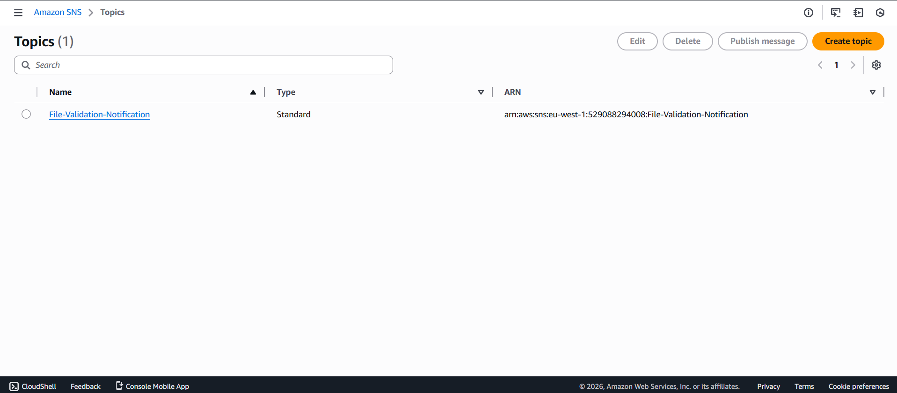

---

### Step 3: Subscribe Email to SNS Topic
- Open the SNS topic
- Click Create subscription
- Protocol: Email
- Endpoint: your email ID
- Check your email and Confirm subscription

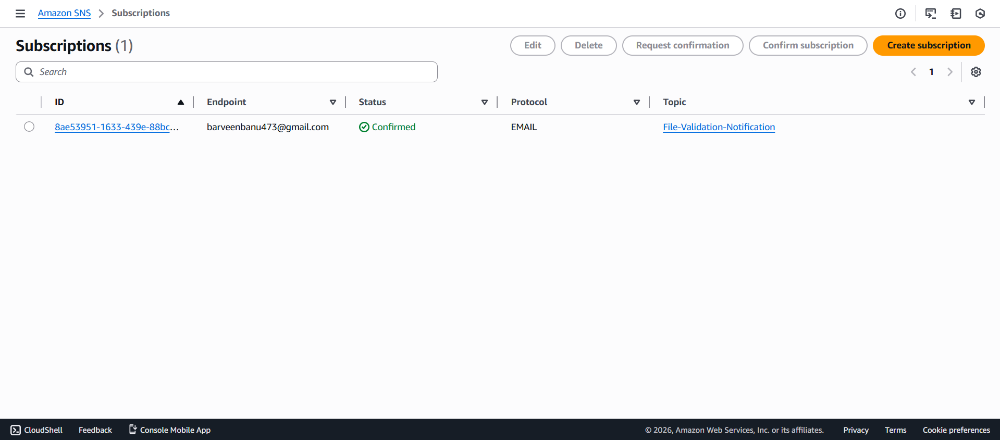

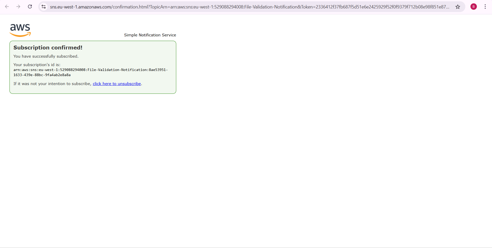

---

### Step 4: Create Lambda Function
- Go to Lambda → Create function  
- Function name: FileValidationLambda  
- Runtime: Python 3.10  
- Create function

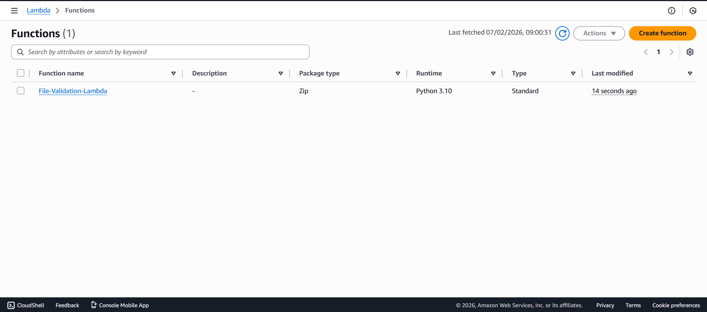

---

### Step 5: Add Environment Variables to Lambda
- Open **FileValidationLambda**  
- Go to **Configuration → Environment variables**  
- Click **Edit** → **Add environment variable**
Add:
- **Key:** SNS_TOPIC_ARN  
- **Value:** `<your SNS topic ARN>`
Click **Save**

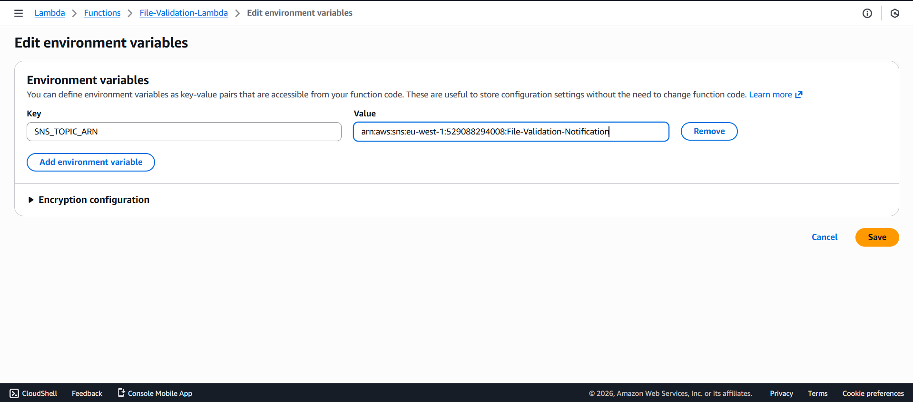

---

### Step 6: Add and Deploy Lambda Code
- Open FileValidationLambda  
- Go to Code source
- Replace the default code with your own code
- Click Deploy

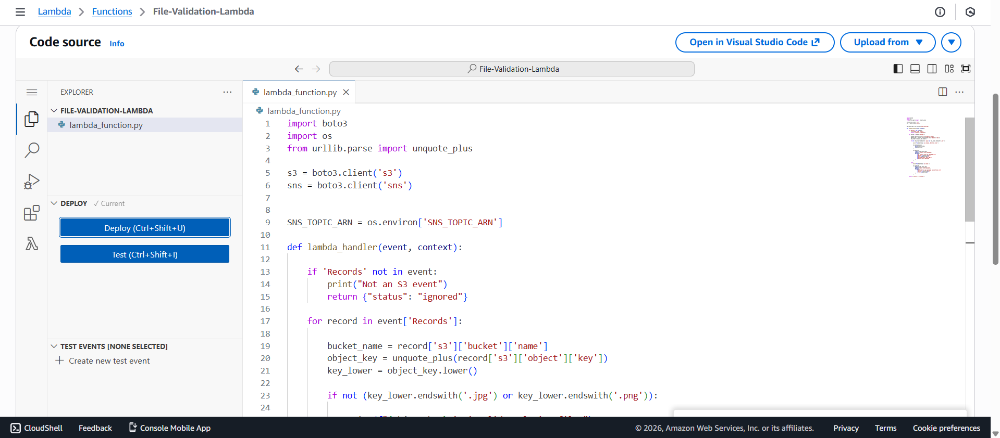

---

### Step 7: Attach IAM Permissions to Lambda
- Go to IAM 
- Lambda Role 
- AmazonSNSFullAccess
- AmazonS3FullAccess 

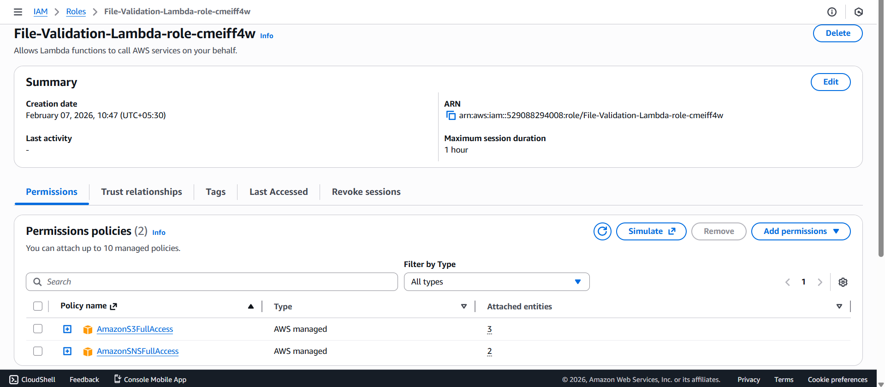

---

## Step 8: Add S3 Trigger to Lambda
- Go to Lambda → FileValidationLambda    
- Open Triggers  
- Click Add trigger  
- Select S3  
- Bucket: file-upload-validation-bucket  
- Event type: All objects create events  
- Acknowledge the permission message  
- Click Add

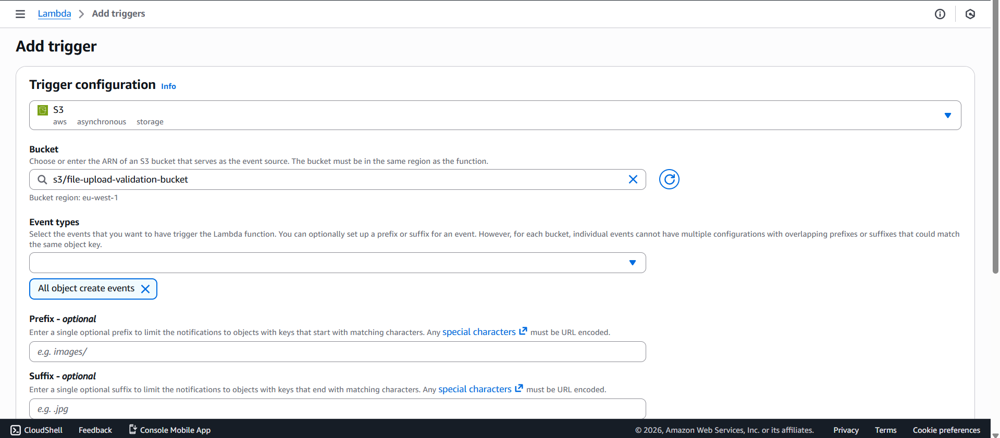

---

### Step 9: Test the Project
### Upload a Valid File
Upload `image.jpg`

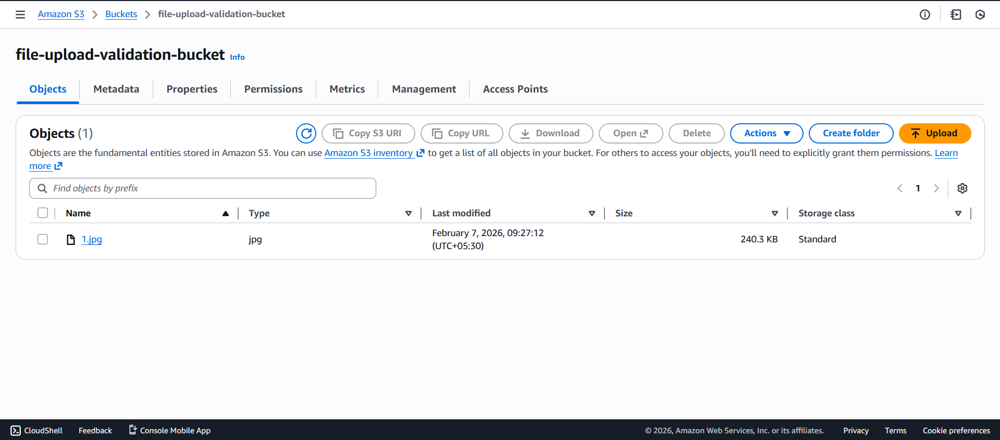

Result:  
- File stays in bucket  
- Email received: **Valid File Uploaded**

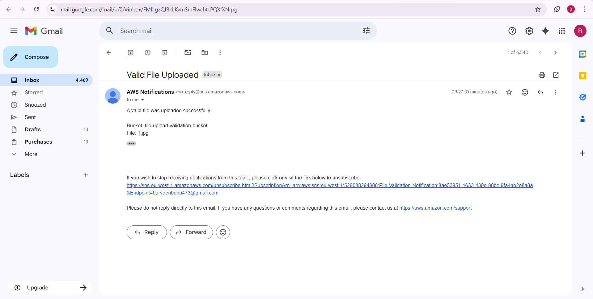

---
### Upload an Invalid File
Upload `userdata.txt`

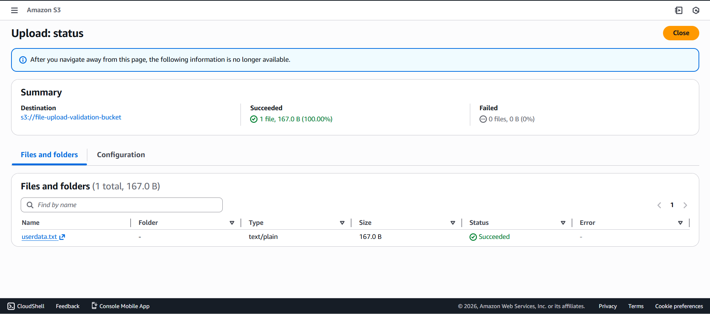

Result:  
- File deleted automatically  
- Email received: **Invalid File Uploaded**

---

## Step 10: Enable Monitoring
Lambda automatically sends logs to CloudWatch  
Monitor:  
- File validation results  
- Deleted file details  
- Errors and execution metrics

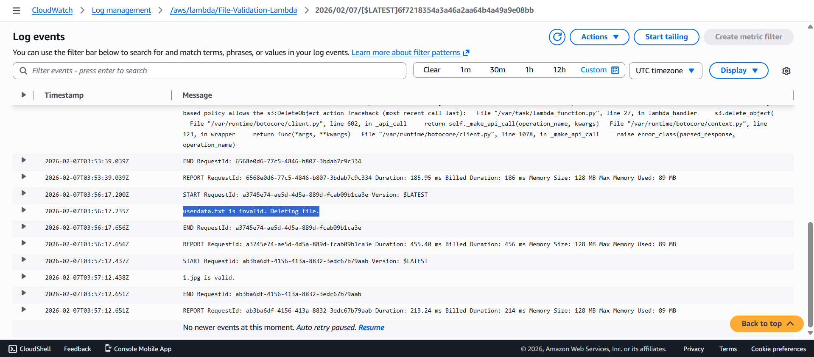

---

## Results
- Valid files are retained in the S3 bucket  
- Invalid files are automatically deleted  
- Email notifications are sent instantly using SNS  
- Serverless architecture reduces operational overhead  
- Scalable and cost-effective solution

---

## Conclusion
This project successfully demonstrates an automated file validation system using AWS services. By integrating Amazon S3, AWS Lambda, and Amazon SNS, files are validated in real time as soon as they are uploaded.
The solution ensures better data control, automation, and immediate notification without manual intervention.

